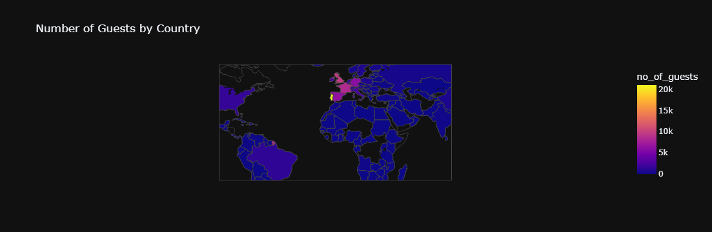
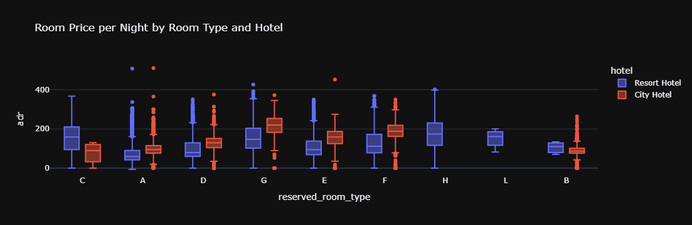
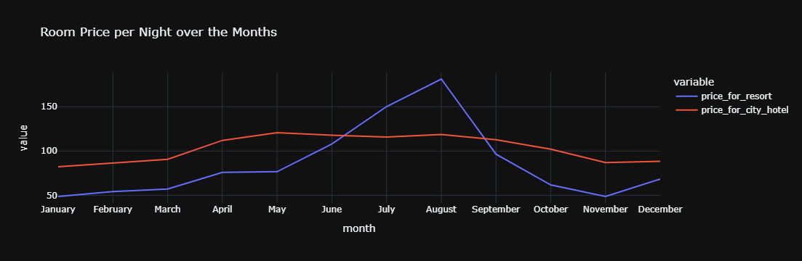
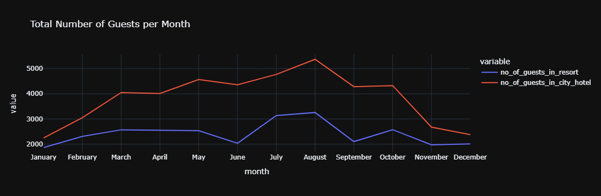
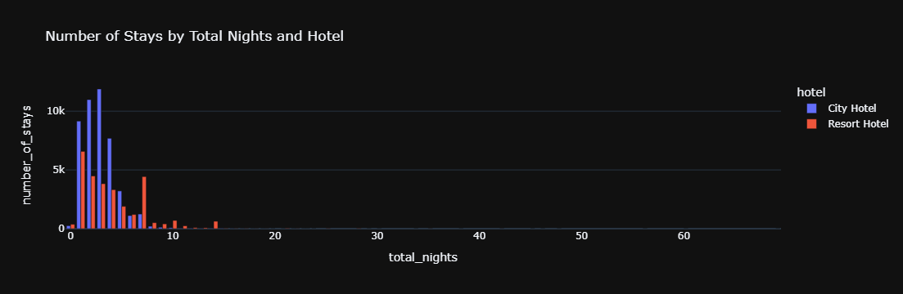
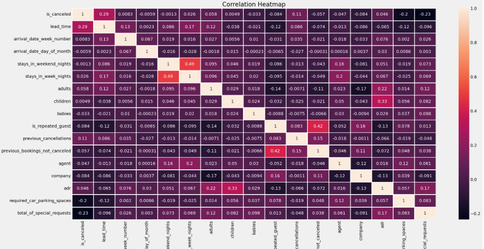

# 🏨 Hotel Booking Analysis (SQL + Python)

In this project, I analyzed hotel booking data using **SQL** and **Python** to uncover key insights into guest behavior, pricing, and cancellations.

---

## 📦 Dataset Source

- 📂 [Hotel Booking Demand Dataset on Kaggle](https://www.kaggle.com/datasets/jessemostipak/hotel-booking-demand)

---

## 🧠 Key Questions Answered (Each with SQL + Python Visualization)

---

### 1. From Which Countries Do Most Real (Non-Canceled) Guests Come?

- SQL used to filter only non-canceled bookings and group by country
- Python used to plot the top countries

📷 

---

### 2. What Do Guests Pay Per Night by Hotel & Room Type?

- SQL used to calculate min, max, average, Q1, median, and Q3 for ADR
- Grouped by hotel and room type

📷 

---

### 3. How Does Price Vary Per Night Over the Year?

- Monthly trend analysis of average ADR per hotel type

📷 

---

### 4. Which Are the Busiest Months?

- Counted number of real bookings per month

📷 

---

### 5. How Long Do People Stay at the Hotels?

- Distribution of total nights stayed (week + weekend)

📷 

---

### 6. Do Lead Time and Special Requests Affect Cancellations?

- SQL used to prepare data
- Pearson correlation done manually with Python

📷 

---

## 🧰 Tools Used

- **SQL**: MySQL, views, subqueries, COALESCE, filtering
- **Python**: pandas, seaborn, matplotlib
- **Jupyter Notebook** for visualizations and insights

---

## 📄 SQL Explanation

All SQL logic with detailed, beginner-friendly explanations is available in:  
[`sql/hotel_booking_queries.md`](sql/hotel_booking_queries.md)

---

## 📁 Folder Structure

```
hotel-booking-sql-python-project/
│
├── notebooks/
│   └── hotel_bookings.ipynb            # Main analysis in Python
│
├── sql/
│   └── hotel_booking_queries.md        # Detailed SQL walkthrough
│
├── images/
│   ├── top_countries.png
│   ├── adr_statistics.png
│   ├── monthly_adr_trends.png
│   ├── busiest_months.png
│   ├── stay_duration.png
│   └── cancellation_correlation.png
│
└── README.md
```

---

## ✅ Summary

This project combined SQL querying and Python visualization to provide end-to-end insight into hotel booking behavior.

Clean data = clearer answers ✨